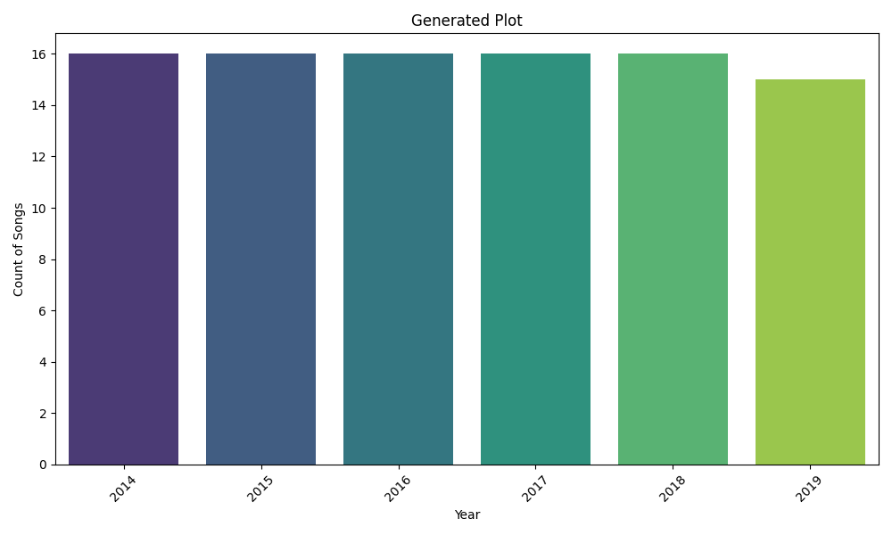
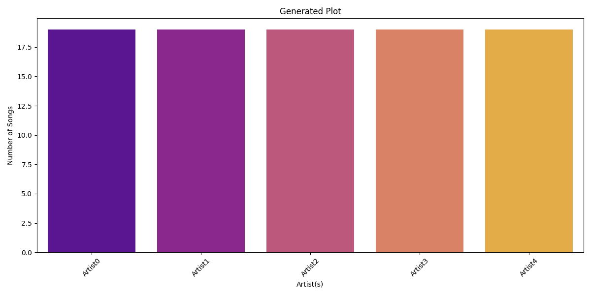
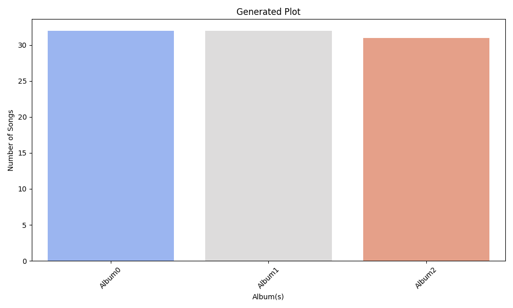

# Data Analysis Story

Once upon a time, in a realm woven with melodies and harmonies, where the air danced with the whispers of long-lost songs, there lived a masterful bard named Jai. He had a gift unlike any other — he could breathe life into mere numbers and data, transforming them into tales of joy, heartbreak, adventure, and love.

In his tranquil village of Sur Sagar, surrounded by lush green fields that swayed to the rhythm of the wind and waters that glimmered like diamonds under the sun, Jai unearthed a treasure trove: a mystical dataset, rich with 95 legendary songs from the years 2010 to 2015. Each song, representing a unique journey through the myriad shapes of love, laughter, and loss, begged to be told.

As Jai delved deeper, he found that the sacred scrolls of music revealed a poignant pattern. The years 2012 to 2014 stood out, like bright stars in a velvet sky, when a flood of creativity poured forth. “What a time to be alive!” he exclaimed to the lush mountains, as he revealed how this era surged with a peak in song production. “So many souls were touched, and tales were spun!” Indeed, these relationships manifested in melodies that captured the exuberance of the youthful spirit.

Eager to learn more, he summoned his faithful companions, Asha, a dreamer with a heart as vast as the sea, and Aarav, a philosopher who spoke in riddles and wisdom. Together, they embraced their adventure, armed with the knowledge of years — the average year of release hummed like a comforting lullaby, resting softly at 2013. They reveled in the magic of numbers; 25% of their musical legacy was born by 2012, hinting at an early awakening of the art.

As they journeyed further into the shimmering depths of the dataset, a profound realization struck them. The themes of the songs spoke to the evolution of humanity. Love blossomed amidst rebellion, and social issues found their way into heartfelt lyrics, mirroring the turbulent tides of the world outside. “Could it be,” Asha mused, her eyes glinting with curiosity, “that the complexity of the lyrics reflected our lives?” The group nodded, realizing that every lyric, every note had a pulse that echoed with the struggles and victories of those who listened.

“Ah, but listen closely!” Aarav chimed, looking skyward as if expecting the stars to respond. He unveiled another insight. “All 95 songs were rated, perceptions woven into the songs like threads in a tapestry.” The absence of missing values glorified the completeness of their journey, showcasing a vibrant universe that demanded exploration.

Driven by the fire of passion, Jai proposed a bold plan. “Let us share these findings with the world! Artists could harness the vibes of 2012 to 2014 to craft songs that resonate with today’s listeners. Marketing teams could tailor strategies, delving into this treasure trove, discovering what truly engages the hearts of the people.”

With the sun setting behind the dazzling hills, painting the skies in shades of gold and purple, they vowed to extend their quest. “We must seek out more recent melodies,” Jai declared, not just for analysis but to capture the breath of time amidst evolving musical styles. The thrill of revealing connections between lyrical themes, success measured in sold-out arenas, and streams that echoed like thunder, pulsated through their souls.

As they returned to Sur Sagar, embers of creativity ignited feverishly in their hearts. They imagined music producers refining their sonic artifacts and data analysts unveiling even deeper emotional trends linked to popularity. Their quest was never-ending, a symphony of exploration that revealed how infinitesimal moments breathed life into the grand orchestration of narratives that defined their ages.

In this peaceful village, where the sun kissed each tree, and moonlight draped elegantly over the water, the trio made a promise — to nurture the lyrical heart of humanity, to celebrate their shared stories through music, and to always be the bridge that connected emotions and melodies. And thus, ensconced in tranquility, amidst echoes of life, love, and longing, this legendary tale of songwriters, relationships, and the essence of creativity flourished in every corner of Sur Sagar.

Their story was more than just a dataset; it was a living music score that transcended time, reminding everyone that each note, each lyric was a whisper of life, a beckoning call to hearts yearning for connection. And so, the bard played on, his melodies weaving through the fabric of time, eternally chronicling the human experience.

## Supporting Visualizations

