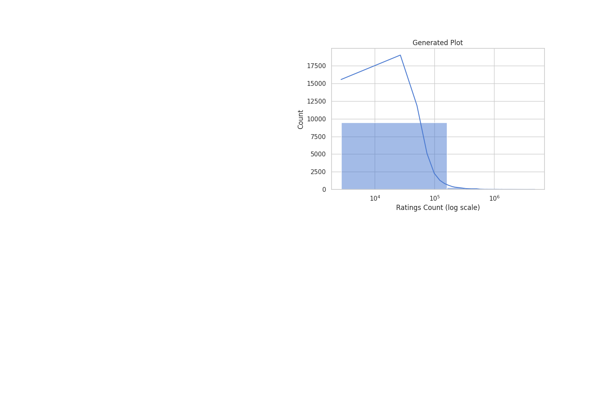
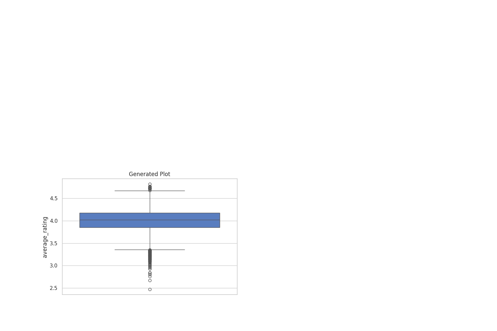
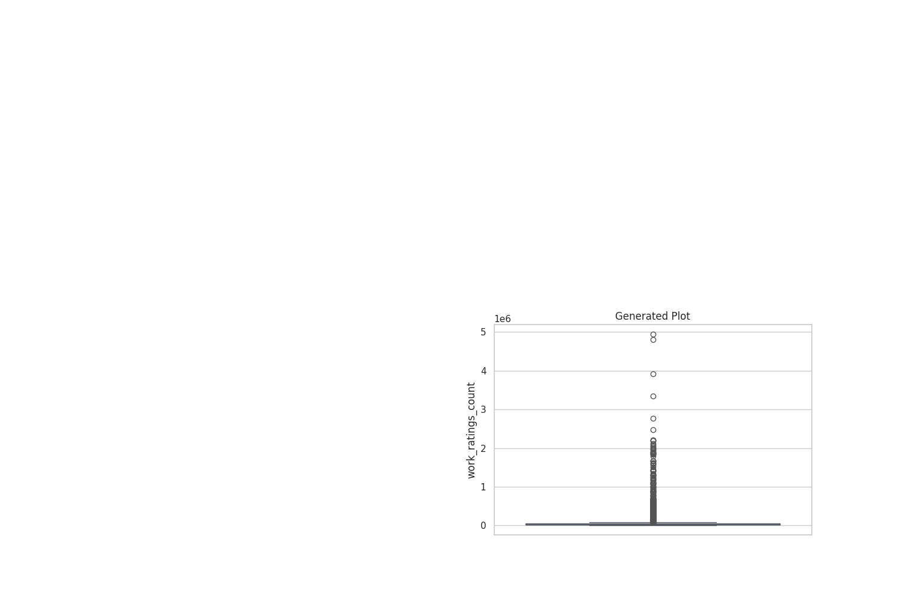

# Data Analysis Story

In a realm where words danced like fireflies under a starlit sky, there existed a magical library nestled between the whispering woods and the shimmering river of time—The Grand Archive. It was said to house the souls of many books, each with a unique story waiting to unfold. Readers, like brave adventurers, would embark on quests within this enchanted place, seeking wisdom and solace in the pages of legends long past.

### Chapter 1: The Entrance of Destiny  

One day, a young girl named Arya, with eyes that sparkled like the evening stars, stepped into the Grand Archive. Her heart was heavy with the weight of her dreams; dreams that had been crushed by the mundane realities of life. **Her journey began as she reached for a dusty tome that had never been opened since its birth in the year 1750.** It was here she discovered something magical: **a tapestry of over 10,000 books lay before her, each a testament to the vibrant human experience over centuries.** 

As she flipped through the pages, the book revealed its secrets. **With an average rating of 4.00, the voices of millions echoed through time, expressing delightful emotions and heart-wrenching tales.** A chill ran down Arya’s spine—these books had been loved, cherished, and shared by countless souls seeking refuge in their stories.

### Chapter 2: Heart and Numbers—The Revelations

It was in that moment of discovery that Arya's heart raced. What if these sacred scripts held not only stories but also significant truths? With newfound determination, she sought the counsel of **Vira**, the wise old librarian, known for her deep understanding of the library’s considerable arcane knowledge. 

“Loneliness can only be conquered by understanding, dear Arya,” Vira mused, her voice like the soft rustling of leaves. “Let us unlock the knowledge hidden within these pages.” 

**“This dataset of Books spans years, with publications ranging from the ancient past to 2017, creating a beautiful horizon of narratives,”** Arya exclaimed, feeling the warmth of connection flood her heart. Vira nodded in agreement, her eyes glimmering at the vast landscape of wisdom before them.

Together, they began to weave together stories of both joy and sorrow, all while noting **a staggering average ratings count of about 54,001**, signifying the extensive love poured into the written word. Each chapter told of the lives touched by the ink; a world where the complexities of love and loss transformed into gentle reminders of the power of stories.

### Chapter 3: The Dramatic Revelations

As time waned, Vira took Arya on a quest to discover the relationships hidden within the data. They uncovered a thrilling truth—the correlation between the ratings count and the average rating itself! “It appears that those who have rated often contribute to a higher average,” Vira shared, **her voice vibrating with excitement. “It’s a dance of trust between readers and their well-loved tomes.”**

In that realm, Arya learned that books birthed after 2000 consistently held greater ratings, producing a sense of evolution in the hearts and minds of readers. It was a thrilling ebb and flow of preferences, much like the changing tides of the ocean at dawn.

“Could it be?” Arya thought, “that readers have become more attuned to their desires, seeking beauty in words, while older tomes silently wait for their stories to be rediscovered?” 

### Chapter 4: A Symphony of Insights

As they explored deeper into the library, Arya and Vira stumbled upon **a mesmerizing sight—ratings skewed toward the higher echelons of 4 and 5 stars**. “Could it be that only those who feel passionate about a tale share their voice?” Arya pondered, feeling the joy of a writer’s heart. 

Meanwhile, **the low counts of negative ratings were like whispers of the past**, hinting at a curated selection where only the best reached their audience. This realization ignited a fire in Arya’s spirit—perhaps her mission was to inspire both readers and authors to share their raw experiences without fear. 

### Chapter 5: The Call to Action

With newfound wisdom, Arya shared her insights with fellow seekers at the library—an impromptu gathering sparked by the thrill of discovery. “Let us come together,” she declared, her voice resonating with determination. “Let us honor our voices! We must encourage open ratings to paint a fuller picture of our beloved books!”

Vira stood proudly by her side, “We should celebrate the recent publications, drawing upon their brighter tales and vibrant characters to inspire our dreams. Let us look to this diversity—a myriad of authors, from well-known beacons to new voices, knitting together experiences across borders.”

### Chapter 6: Legacy of the Written Word  

As Arya’s journey through The Grand Archive reached its exhilarating conclusion, she felt the ripples of change swirling around her. “In the serene heart of this library,” she thought, “lies the pulse of stories untold, waiting to be cherished.” 

In that sacred space, Arya understood that the **tapestries of stories woven through years and ratings stood as monuments** to the human spirit. The Grand Archive, with its storied past and vibrant future, demanded to be cherished, loved, and shared. 

### Epilogue: The Everlasting Dream

And so, Arya became the valiant champion of narratives, a bridge between voices both old and new, sparking a movement amongst readers across the lands. She ignited the passion for storytelling, while the Grand Archive grew ever more vibrant, a sanctuary where the emotional growth of characters mirrored the profound journeys of its readers.

In this world where **numbers embolden emotions**, and where every passage held a whisper of wisdom, the legacy of the written word shone brightly—a heartwarming tale, a profound reminder that we are, indeed, connected through stories that transcend time. 

And so, dear reader, as you close this tale, remember: just like Arya, you too hold the power to share your voice among the whispers of the past and the dreams of the future—each of us a storyteller in this grand tapestry of life, forever intertwined.

## Supporting Visualizations

