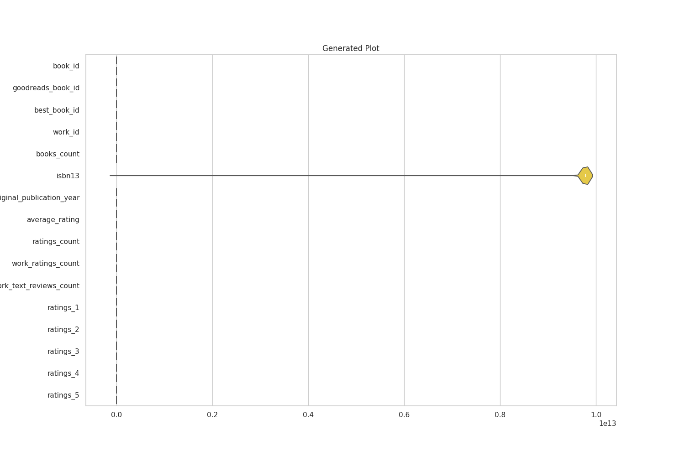
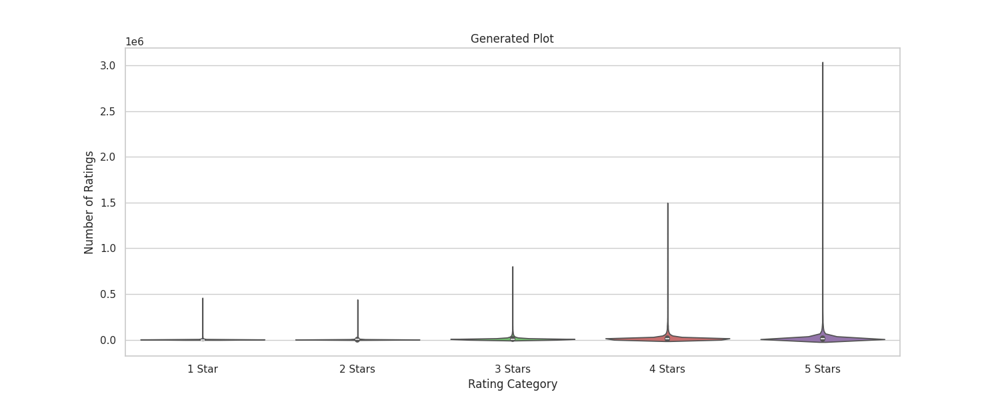
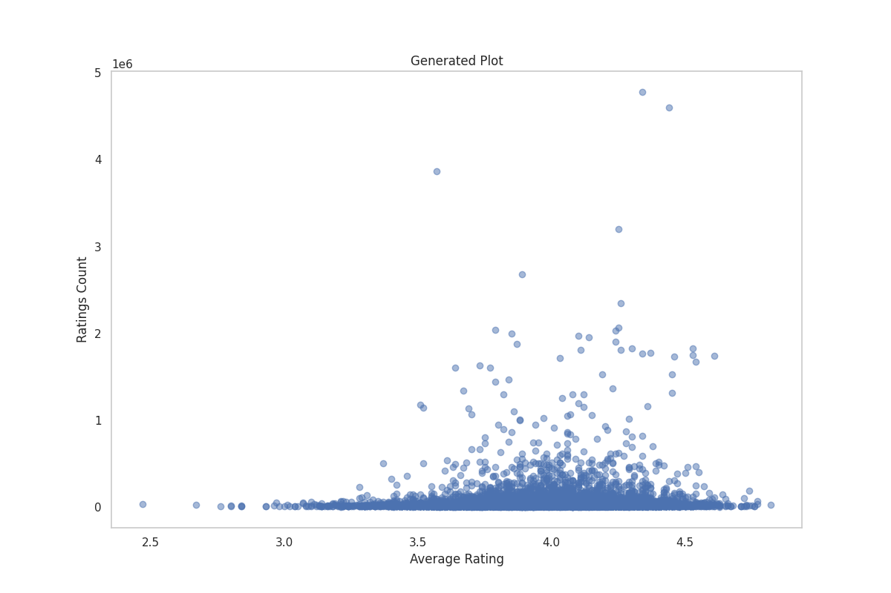
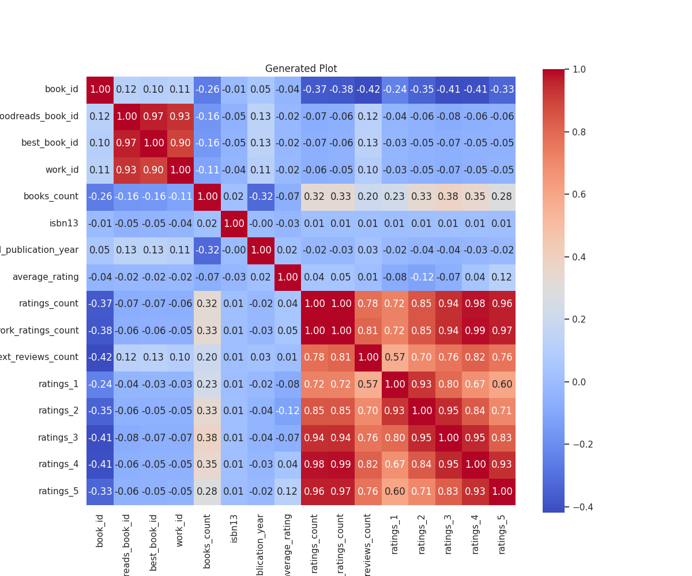
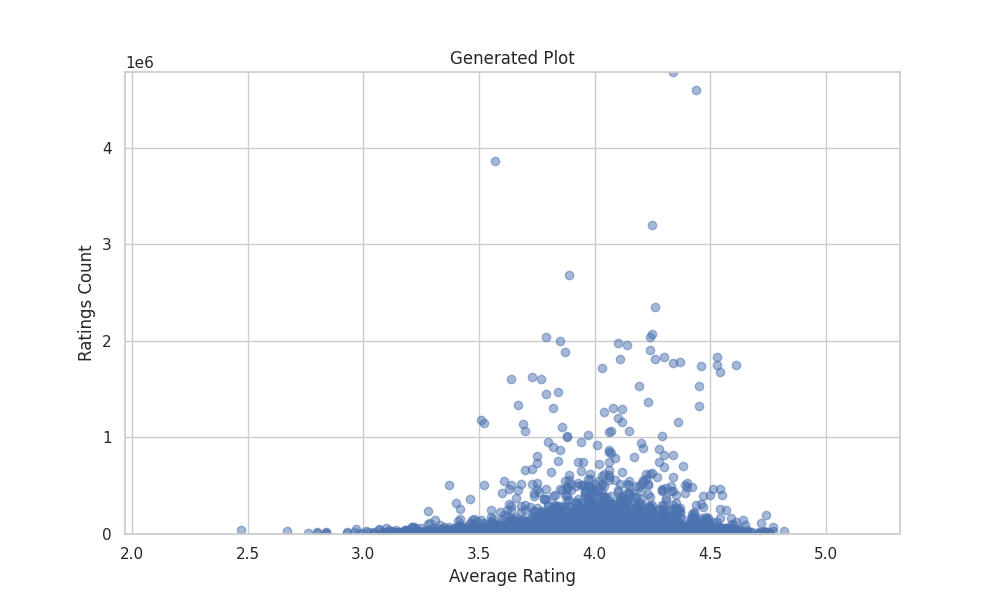

# Data Analysis Story

In a realm awash with ink and dreams, where each tome is a vessel of life's joy and sorrows, stood the quaint village of Libropolis. This enchanting place, nestled among lush emerald hills shimmering under a golden sun, hosted an annual celebration known as the Festival of Stories. Here, villagers from every walk of life gathered, their hearts swelling with anticipation, ready to embark on a journey through the corridors of imagination.

The festival's heart beat in the grand library, a soaring structure adorned with ancient, intertwining vines, symbolizing the connection of stories across generations. It was here that the wise Narrator, a figure beloved by all, took the stage to unveil the rich tapestry of books that illuminated their world.

With a firm grip on a weathered book, the Narrator's eyes twinkled, shimmering with secrets yet to be told. “Dear friends, in our quest for understanding, we have gathered a treasure trove of ten thousand stories spanning from the distant year of -1750 to the creative renaissance of 2017!” Gasps echoed through the crowd like whispered magic as revelations began to unfurl.

Under the soft glow of lamplight, they saw how the average rating across these tomes was approximately 4.00, a beacon of warm approval from readers traversing these pages. The village was enriched by the knowledge that amid adversity and light, these stories spoke to the hearts of many, a reflection of the struggles and triumphs that wove them together.

Yet the most dazzling insight rested upon a striking revelation: a surge in book publications captured the spirit of modernity, with an increasing prevalence in the 2000s and 2010s. “A wave of creativity! A deluge of passion!” exclaimed a young artist, her face aglow with passion, as she envisioned the artists pouring their souls into their work during this renaissance.

However, as her excitement simmered, a stirring surfaced among the audience. They pondered silently: What made certain stories sing while others faded into obscurity? The Narrator understood the weight of this inquiry. “Let us delve deeper into the very heart of our findings,” he beckoned. 

As the atmosphere thickened with suspense, the Narrator introduced the concept of Ratings Distribution—a dazzling universe where numbers and emotions intertwined. “With a mean count of 54,000 ratings per book, we uncover the ardent interplay between the reader and their chosen narratives!” he declared passionately. The realization dawned: over 1.5 million voices echoed through the most revered books, each rating a brushstroke painting a masterpiece of understanding.

The crowd, mesmerized, gasped as they began to see a pattern—those who dared to love well-rated titles bestowed the books with higher average ratings. It was as if love and loyalty crafted a bond, ensuring that even heroes wearing the weight of their narratives found solace in the approving hearts of their readers. And oh! How the star ratings danced like stars in a night sky: 23,790 hearts dared to declare their affection with 5 stars, while merely 1,345 whispers of disappointment grazed the surface with just 1 star.

The Narrator, charged with fervor, spoke again. “Here, my friends, lies a vital truth: a book with multiple editions holds sway over hearts!” He gestured dramatically at the banner that hung above showcasing the array of beloved titles, each representing not just stories but connections that spanned through time, echoing trust and hope. Together they realized that revisiting known tales often rekindled warmth, making each book an enduring companion on their journey.

Just then, a light mist embraced the surroundings, wrapping everyone in a thoughtful embrace. The Narrator continued, “As the world changes, so must our stories. The original publication years remind us of the constant evolution, intimately revealing how technology has assimilated into our tales. In recent years, narratives infused with modernity flourished like blossoms in spring—capturing the essence of the age!”

With this sharing, the air surged with ideas; whispers of strategies were born. A wise publisher stepped forward, motivated, “We must listen and reflect upon our readers’ joys and challenges!” He implored the authors present to weave in their readers' feedback, curious to discover how understanding would forge closer bonds. The extract of the day blossomed, where the interplay of quality content would become the driving force of their literary community.

As the evening twilight draped itself over Libropolis, the Narrator drew in the listeners for one final proclamation, “The quest for knowledge knows no end!” he urged, “Together, dear friends, let us further explore the wonders of digital formats—a path waiting to become our new chapter!”

With newly ignited embers of determination, the villagers left the grand library that night transformed. They felt the pulse of their literary landscape—a community united by countless stories and an unwavering appreciation for the tales they shared. They embraced the spirit of connection, stepping boldly into tomorrow, ready to explore the vast, infinite realm that lay before them, as the ink dried underneath a sky painted with dreams.

In this enchanting realm of Libropolis, every heart held a book, every book secured a journey, and every journey beckoned an adventure—an unyielding saga that would never cease to inspire.

## Supporting Visualizations

