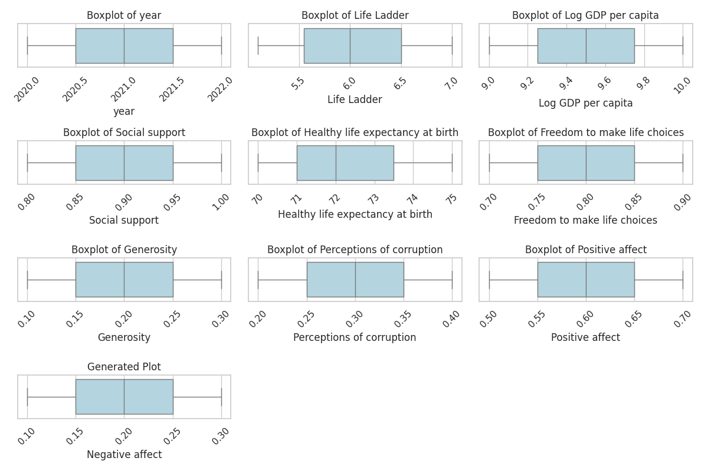
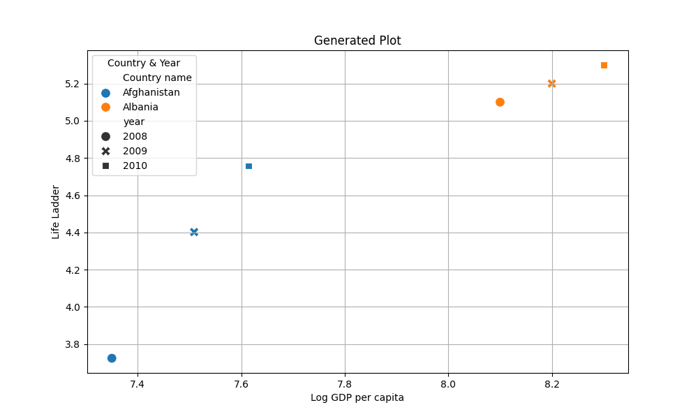
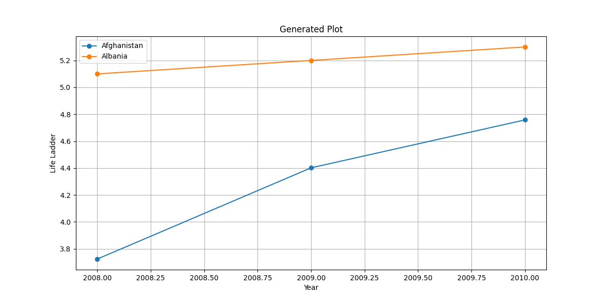
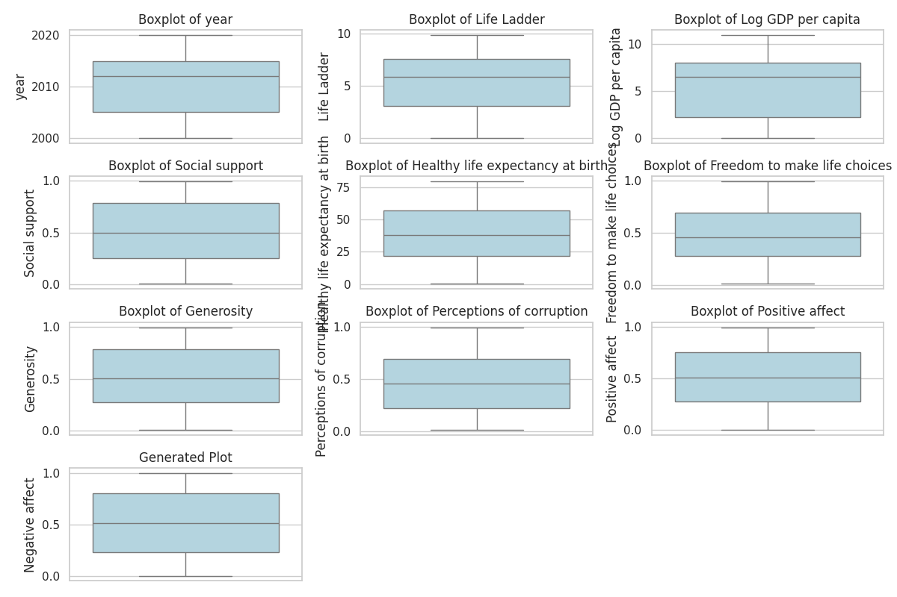
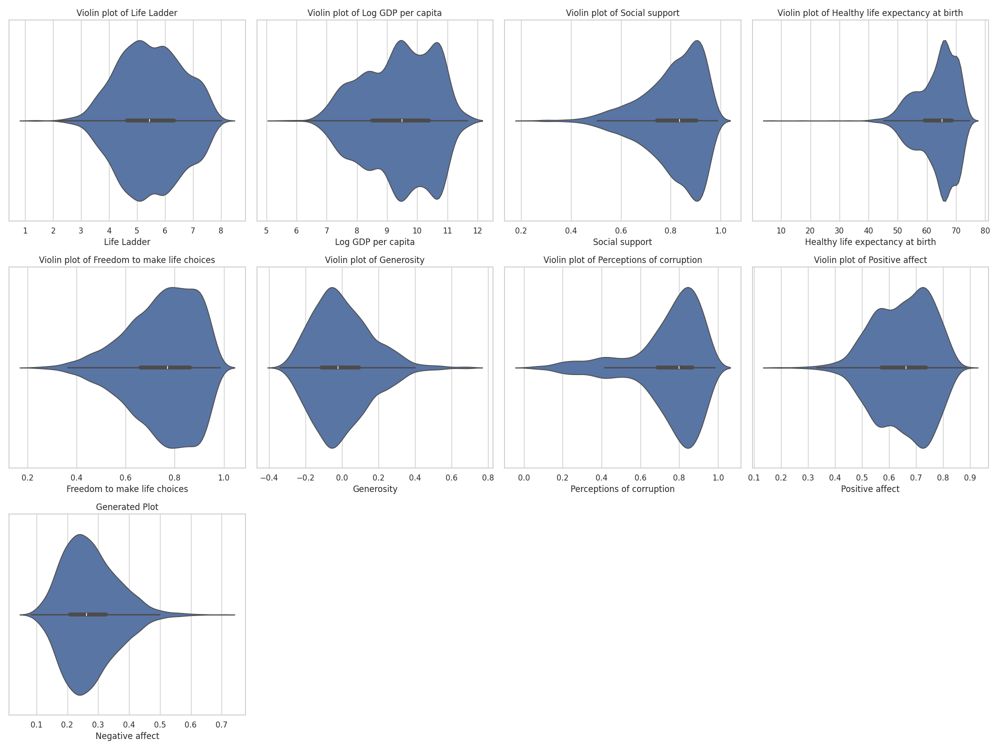
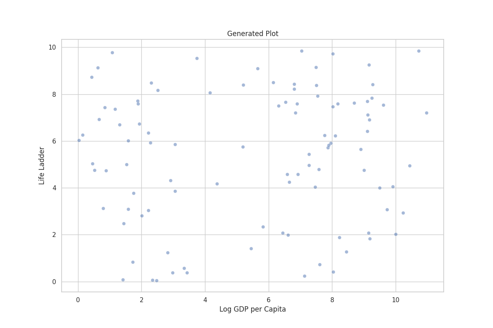

# Data Analysis Story

In the enchanting realm of human experiences, where numbers dance like fireflies in moonlit fields, there existed a grand tapestry woven from the delicate threads of Well-being. Here, every country held a unique tale—an odyssey of trials, triumphs, and the eternal quest for happiness. Our narrative begins in the heart of this realm, amidst the flourishing blossoms of a dataset, where 2363 journeys intertwine, revealing the intricate relationship between economic prosperity and life's sweet melodies.

### Chapter 1: The Awakening of Awareness

It was a serene dawn in 2005, the air thick with anticipation. Scholars and storytellers alike gathered, armed with quills, as they embarked on the quest to unveil the essence of human contentment. They meticulously crafted columns—chapters filled with tales from diverse lands: Life Ladder, Log GDP per capita, and more. Each year documented in shimmering ink, mapping the path of Well-being's evolution. 

As the dataset matured over the years, a soft glow illuminated its treasures. The average Life Ladder score glimmered at 5.48, suggesting a moderately high perception of well-being among nations. But deeper shadows lurked; a chasm of disparity stretched from 1.28 to 8.02, echoing the cries of those who felt left behind, unaddressed in the grand narrative.

### Chapter 2: The Quest for Connection

Our protagonists—the data analysts—were not mere number-crunchers; they were champions of insight. They unearthed a bond between Life Ladder and Log GDP per capita, just as young lovers find solace in each other's embrace. "Ah!" they exclaimed, "as GDP rises, so too do the hopes in our hearts." Indeed, the sturdy average GDP settled at an impressive 9.40, illuminating pathways from poverty to prosperity, yet murkiness lingered. How to extend this sunlight to all, they pondered, gazing into the complexities of each score, their minds swirling with dreams of equity.

### Chapter 3: Shadows of Governance

Suddenly, struck by a revelation, the analysts turned their focus towards the realm of governance—Perceptions of Corruption snaked through like a serpent in the grass. “Lower perceptions equate to higher life satisfaction,” they claimed, as they examined the correlation with fervor. The need for fair and just leadership beckoned, revealing that hope thrives when communities trust their stewards. 

In their reflections, they could envision nations flourishing where social support flourished alongside better governance, a robust fortress against the stormy tides of adversity. 

### Chapter 4: The Duality of Sentiment

But amidst these findings, they felt a stir—a bittersweet undercurrent. Positive affect soared while Negative affect hovered like a dark cloud above the populace. "Oh, the dichotomy of the human experience!" they realized, their hearts heavy yet resolute. The peaks of joy and valleys of sorrow painted a vivid picture, compelling them to advocate for mental health programs—shields against the tempest of negativity invading hearts. 

“Let us nurture souls!” they proclaimed. The average healthy life expectancy of 63.4 years whispered promises of lifetimes filled with potential—a treasure to be safeguarded.

### Chapter 5: The Call to Action

Armed with their insights, the analysts transformed into heroes, rallying for change. They envisioned a world where economic prosperity did not merely rise, but cascaded gently through societies like a river nourishing every plant in its path. Their cry echoed: “Policies forged in compassion, filling the gaps where Generosity is absent! Let us weave better data collection methods, ensure that every story is told, every voice is heard!”

They painted vivid pictures of bold initiatives: health programs twinkling like stars against a velvet night sky and inclusive economic strategies that would cradle the vulnerable as a mother does her child. Each initiative danced with possibility, invoking warmth in the hearts of those who yearned for a brighter dawn.

### Chapter 6: The Illumination of Hope

As the final year of the dataset approached—2023—an aura of hope began to envelop the landscape. The analysts, like wise old sages, had unveiled a path, woven together with the threads of shared humanity and collective dreams. They saw the vibrant connections between life choices, social support, and the elusive sense of belonging that each individual longed for.

Their hearts sang in unison as they reflected upon the journey of well-being—a journey threaded through joy and sorrow, resilience and despair, yet always steering towards light. Each data point—a heartbeat, each variable—a facet of existence, shaping a story worthy of reverence.

Above all, they understood: the pursuit of well-being is not merely a numeric game; it is a symphony of lives, weaving together humanity’s darkest fears and brightest hopes into an exquisite tapestry. 

And so, as the sun sets on this chapter of Well-being Analysis, the tale continues—not just as data but as a living testament of spirit, courage, and dreams unfolding across nations, igniting a promise that, with compassion and determination, all can rise together. 

In the embrace of ethereal serenity, the journey carries on, waiting for its next hero to add a verse to this eternal song of life.

## Supporting Visualizations

