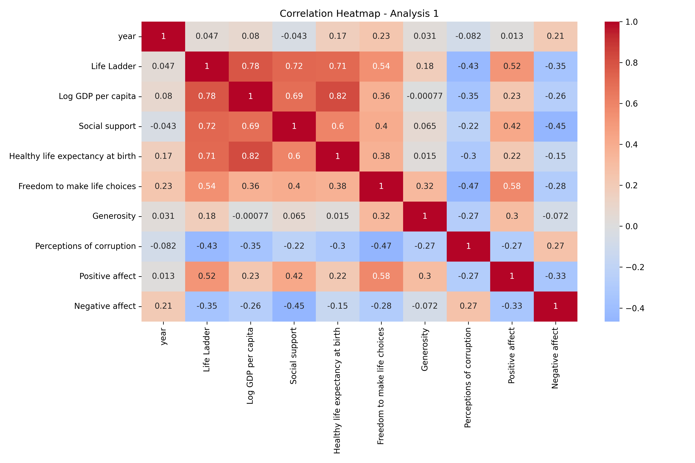
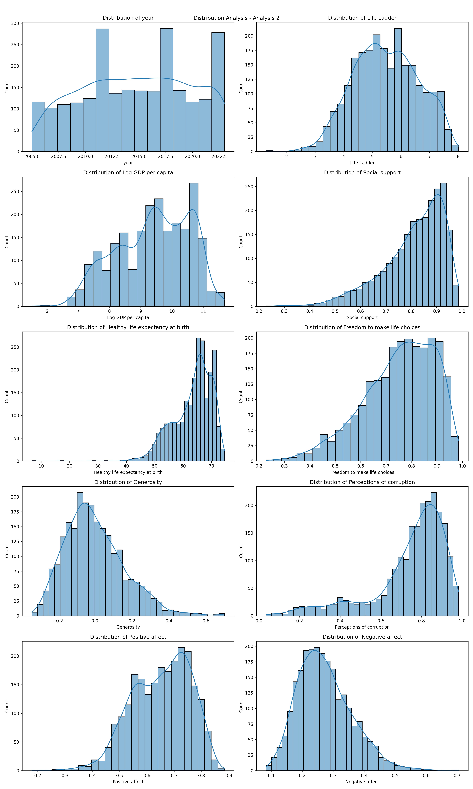

# Data Analysis Report

### Analysis Report

#### 1. Summary
The dataset comprises 2,363 rows and 11 columns, covering a temporal range from 2005 to 2019, with an average year around 2014.76. The analysis focuses on subjective well-being indicators, particularly the Life Ladder and Positive Affect scores.

#### 2. Key Findings
- **Life Ladder**: The average score is 5.48, indicating a moderately high perceived quality of life among respondents.
- **Variability**: The standard deviation of Life Ladder scores is 1.13, showing significant variability in life satisfaction.
- **Positive Affect**: The mean positive affect score is 0.65, with scores ranging from 0.18 to 0.66, reflecting a generally positive emotional state among participants.

#### 3. Recommendations
- **Targeted Interventions**: Develop programs aimed at improving life satisfaction, particularly in regions or demographics with lower Life Ladder scores.
- **Further Research**: Conduct qualitative studies to explore factors contributing to the variability in life satisfaction and positive affect.
- **Monitoring Trends**: Establish a framework for ongoing data collection to monitor changes in life satisfaction and emotional well-being over time.

## Visualizations

