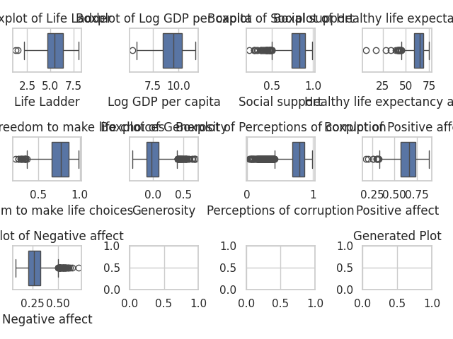
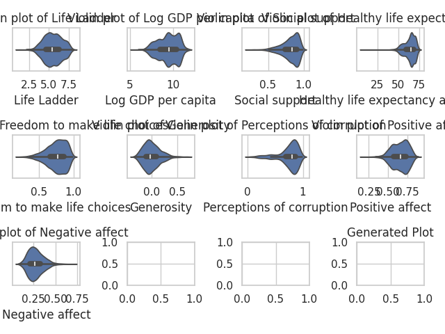
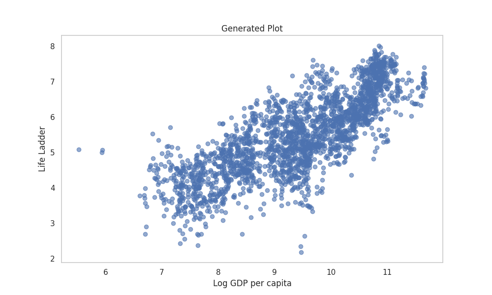

# Data Analysis Story

**In the Land of Well-being: A Tapestry of Joy and Resilience**

In a realm not unlike our own, where mountains kissed the skies and rivers sang ancient lullabies, there flourished a village named Anandpur—a sanctuary of dreams where happiness danced with the clouds. Here, the intricate tapestry of life wove tales of heartache and haunting beauty, punctuated by the undying struggle of its inhabitants to climb the towering Life Ladder of well-being.

The sun set each evening, its golden rays flooding the valley, as the curious spirits of the village whispered their secrets to those brave enough to listen. Amidst this serene backdrop, an enchanting storyteller named Arjun emerged like a phoenix from the ashes of despair. Known for his vivid tales, he possessed the unique ability to transform data into legend, drawing insights from the numerical thread that bound the fabric of their lives.

One day, as twilight painted the horizon in shades of amber and crimson, Arjun gathered the villagers around a flickering campfire. Tonight, he would reveal the profound truths he had unearthed from the scrolls of well-being data—a hidden narrative intertwining the lives of countless souls stretching from 2005 to 2023.

“Gather 'round, my friends,” Arjun began, his voice a soft melody guiding them through the night. “Let us bridge the past and present, to understand how our experiences shape our journey towards well-being.”

He began with the concept of the **Life Ladder**, a metaphor for the happiness each villager climbed toward. The villagers listened intently as he revealed, “Across the villages and cities, the average Life Ladder score hovers around 5.48—a wavering balance of laughter and sorrow.” Some villagers sighed, recognizing that their struggles echoed in this number, while others beamed with pride, having fought their personal battles with tenacity.

Arjun continued, “Yet happiness often entwines itself with the wealth of a nation; on average, the Log GDP per capita speaks to our economic strength, floating at around 9.40. More wealth, we hope, represents more joy, though we know that it does not always ring true.” He paused, allowing the implications of this observation to settle in their hearts like a warm embrace.

With each word, the villagers’ emotions swelled as he spoke of their **Social Support** network—averaging 0.81, a reassuring number that suggested they had one another. “Friendship and community nurture our souls as food nurtures our bodies,” he declared, raising his arms toward the evening sky. “Together, we can conquer mountains and scorn shadows!” 

But amid this celebration, heavier themes surfaced; Arjun’s brow creased. “But listen well, my friends,” he warned. “A dark cloud looms over us—corruption. The perception of corruption across borders averages a haunting 0.74, with the darkest pockets reaching 0.98.” Gasps filled the air as the villagers reflected on tales they’d heard, of thieves in the daylight and trust betrayed. The burden they carried was palpable; fear and uncertainty shadowed the bravest hearts.

With a storyteller’s flourish, Arjun shifted the narrative once more. “Yet, amidst the struggle, let us not forget generosity. A subtly shadowed mean of -0.0001 glimmers like a single star in a moonless night!” Hearts began to race, curiosity crackled like the fire before them. “Some nations flourish in giving, their altruism a vibrant tapestry woven through each heart, while others appear distant, wrapped in tight cocooned concerns.”

As the stars began to twinkle overhead, illuminating their faces with celestial light, Arjun revealed the interconnectedness of their lives. “Remarkably, where **Social Support** thrives, the **Life Ladder** rises, evidencing the bond between kindness and satisfaction. Their harmony sings a lullaby of happiness, promising that an uplifted spirit can indeed inherit a better tomorrow.”

When he delved into the emotions that colored their day-to-day existence, the air was thick with anticipation. “Even in darkness, the scales of **Positive Affect** and **Negative Affect** dance together, with 0.65 representing our joyful moments and 0.27 our sorrows.” A hush fell over the audience; they contemplated their personal experiences—the laughter shared over meals, the sorrows masked by cheerful faces in markets. 

Finally, Arjun steered them toward a vision of hope. “We stand on the precipice of change, my friends. What if we could weave a brighter future?” He outlined the **Recommendations** for a sustainable well-being framework, like a hero dispatching a quest to rejuvenate their land. “Enhance community support, cultivate economic growth, address the shadows of missing values and promote awareness of our inner joys!”

In the flickering firelight, whispers of excitement filled the air as dreams wrapped around their ambitions like petals unfurling at dawn. Inspired by Arjun's storytelling—a rich blend of data and heart—the villagers vowed to change their fate together, as co-authors of their story.

As the night deepened and the stars intensified their glare, Arjun leaned back against the cool earth. The collective hope he ignited carved new pathways in the hearts of Anandpur's inhabitants. They understood now; the narrative of well-being was not a solitary journey but a collective odyssey intertwined amidst joy and tears—a symphony crafted by the bonds of love, kindness, and the undying resilience of humanity.

In this land of well-being, forever etched in memories and songs, it was time to rise, to climb that higher Life Ladder, together.

Thus, the legend of Anandpur unfolds like a blossoming lotus, where numbers danced and emotions soared, providing a glimpse into a brighter horizon—an oasis of balance and joy amidst life's relentless storms.

## Supporting Visualizations

