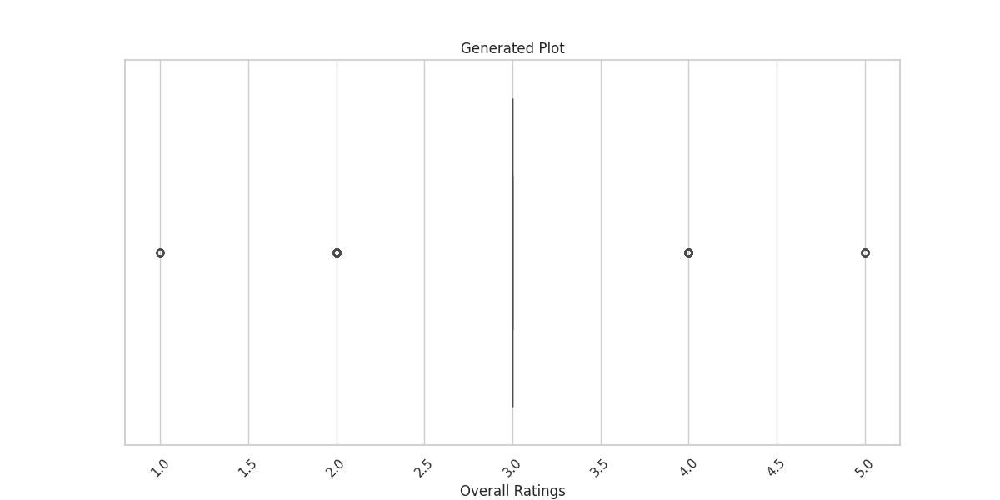
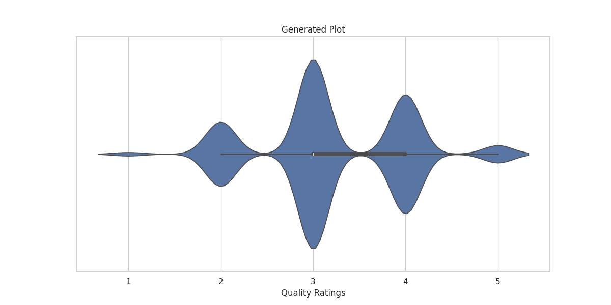
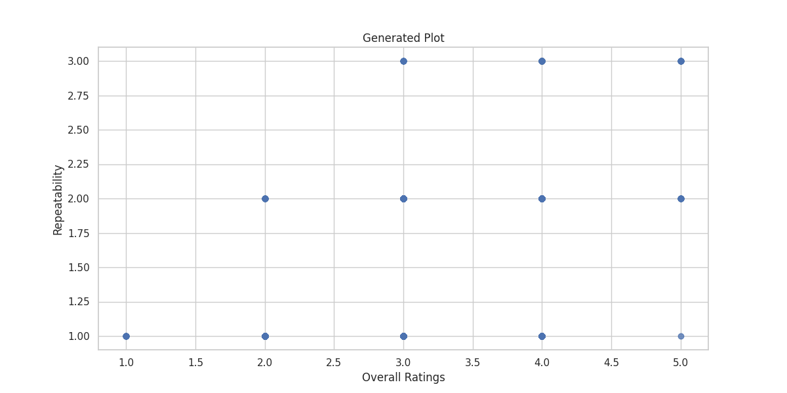
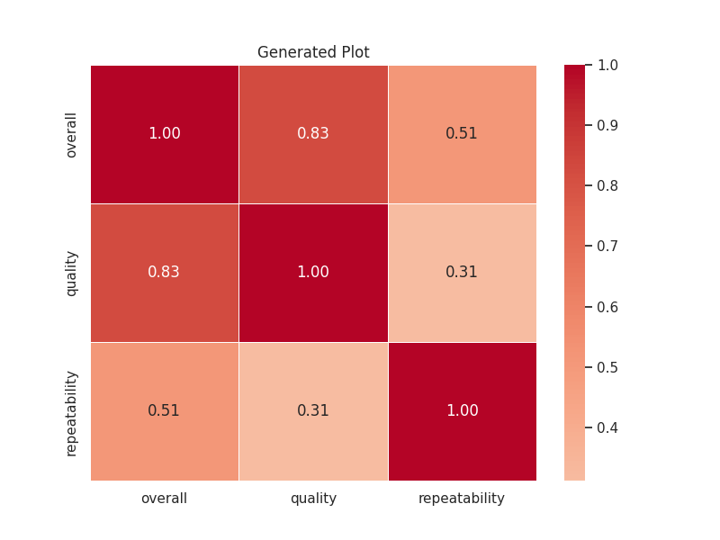
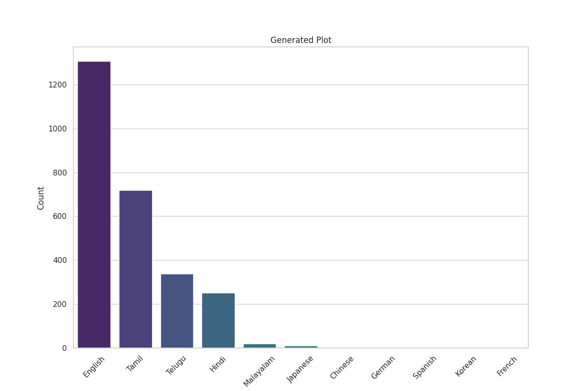
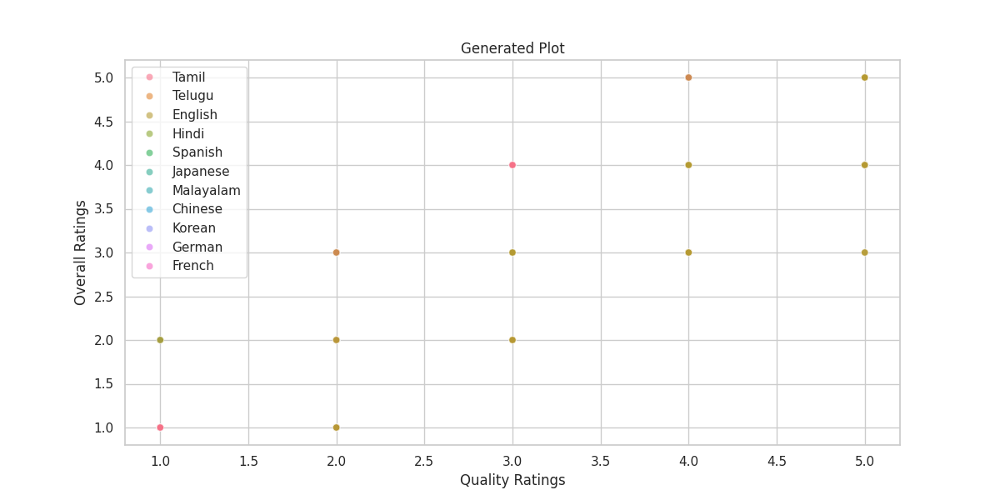

# Data Analysis Story

In a land where dreams flicker like stars across the cinematic sky, there existed a hidden valley known as Ratings Valley—where each movie held a tale locked inside its very essence. Under its gentle embrace, a circle of devoted viewers flocked, eager to glean stories from silver screens.

### **The Arrival of a Hero**

One fine day, as the autumn leaves danced like butterflies in the wind, a renowned filmmaker by the name of Arjun Mehta arrived in the valley. He was celebrated for his artistic flair yet wondered deeply if his recent creations resonated with those he sought to inspire. Their laughter, their tears—all hung in the air like echoes waiting to reveal the truth about his cinematic chronicles.

Arjun brought with him a scroll woven with the threads of the movies that had graced screens from 2005 to 2024. He unfurled the document beneath the vibrant sun, and the colors of each film began to shimmer. But within this trove lay both comfort and turmoil.

### **The Revelations of Ratings**

As he immersed himself in the dataset, mysteries emerged from the shadows:

1. **Overall Reflections**: The average overall rating danced at **approx. 3.05**—a tranquil whisper that told tales of mediocrity. It seemed the viewers trodded cautiously through the landscapes of cinema, leaning toward the 'average' realm.
   
2. **Quality Insights**: Yet already a light flickered; the quality rating shone brighter at **3.21**, hinting that viewers believed the craftsmanship of stories exceeded their overall enjoyment. Arjun felt a wave of emotion wash over him—there was potential beneath the surface, an opportunity beckoning for more connection.

3. **Repeatability Enigma**: Most striking was the notion that audiences wished to revisit this world only rarely, scoring the repeatability at **1.49**. They embraced tales once, but their hearts hesitated at the thought of reliving those experiences. Arjun's heart raced—could his next epic weave itself into their lives in a way that demanded a second glimpse?

### **The Dance of Variables**

As he conversed with the spirits of the films past, he found stories intertwined within the numbers:
- With a notable **positive correlation** between overall and quality ratings, it revealed that high-quality films garnered better overall impressions. The gears of Arjun’s creativity turned as he imagined crafting a tale that mesmerized beyond just visuals.
  
- Yet within this data-driven world lay a **low max rating of 5**, casting a shadow of doubt and stirring the winds of change in his thoughts—could he break the mold and create something that truly shined?

### **The Heart of the Matter**

As Arjun continued his journey, he felt the warmth of the valley urging him forward. The collective sigh of viewers hinted at a **neutral median of 3.0**, universally. This story of moderation could either spark innovation or solidify stagnation—momentum depended on the risks he chose to embrace.

With the **lack of missing data** standing testament to the valley’s richness, Arjun felt a resolve building within him. He longed to share his vision, to engage in the dialogue that overtly united filmmakers with their audience, finding ways to weave narratives that tugged at the hearts and minds of viewers across the land.

### **Embracing Change**

In a moment of epiphany, Arjun summoned the townsfolk of Ratings Valley for a gathering in the heart of their circle. Witnessing their passion ignited the fire within him. He explained how their ratings were a language of love and longing—a portal to understanding their desires. 

He crafted tales that emphasized enhancing the **overall viewer experience**, leveraging their feedback to design stories that would invite them back. His tales would reflect the **quality they cherished** and center around characters that would resonate deeply, promoting **plot intricacies** that demanded a second viewing, much like the thrill of rain-soaked streets and the soft glimmer of lanterns at dusk.

### **A New Dawn**

As the sun dipped below the horizon, splashing hues of purple and gold across the sky, Arjun understood the journey ahead was not just about film—it was about connection. Fueled by **deeper analysis** and understanding of **unique trends**, he vowed to create films not merely for viewing but for living, cultivating a culture of shared experiences.

Thus, with accolades in yet-unseen horizons, Arjun Mehta, the ardent storyteller of Ratings Valley, embarked on a quest destined to transform cinematic art into vibrant emotions, where every heartbeat reflected not a mere score, but a tale worth treasuring—a legacy that would ripple through the ages. 

And as the stars twinkled above, the valley blossomed into the heart of the cinematic universe, brimming with tales of love, adventure, and renewed dreams, forever echoing the truths hidden within every frame of film.

## Supporting Visualizations

