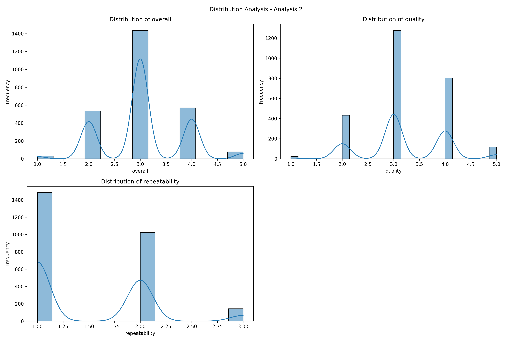

# Data Analysis Narrative

# The Story Behind the Scores: Unraveling the Book Dataset

## Chapter 1: A Glimpse into the Scores

In a world bustling with countless titles and narratives, our dataset paints a vivid picture of reader satisfaction. With an overall mean score of **3.05**, we wonder: Is this a triumph of literary achievement or a cautionary tale of unmet expectations? To uncover this, we dive into the details—stirring beneath the surface lies a more granular look at quality and repeatability, guiding us through the highs and lows of the reading experience.

### Insights:
- **Overall Score**: 3.05 - A call for moderation.
- **Quality Score**: 3.21 - A beacon of slightly above-average appeal.
- **Repeatability Score**: 1.49 - A whisper of uncertainty, where readers seem to struggle to agree on the consistency of their experiences.

## Chapter 2: Patterns and Trends Unearthed

As explorers of the dataset, we examine the **standard deviations** that offer insights into diversity within our data. The standard deviations for overall (**0.76**) and quality (**0.80**) scores suggest a moderate spread—there are opinions on either side of the average score, proving that while some readers find joy in their literary journeys, others feel left behind. Conversely, the repeatability score has a standard deviation of **0.60**, hinting at a more cohesive sentiment, albeit a critical one.

### Distribution Dynamics:
- **Scores Range**: From **1** to **5**—a spectrum of emotions.
- **Quartiles**: The 25th percentile huddles around **3**, showing that not just a few, but at least **50%** of the respondent pool are scoring **3 or higher**—a sign that optimism exists, but isn’t universal.

## Chapter 3: The Interplay of Impressions

The connections between our variables speak volumes. A likely **positive correlation** exists between overall scores and quality ratings—better quality begets happiness, a classic adage that rings true here. Yet, as we delve deeper into the repeatability score of **1.49**, it prompts us to consider: Are we hearing varied voices of discontent among the pages?

### Relationships:
- **Overall vs. Quality**: Strong, as they bolster each other.
- **Quality vs. Repeatability**: Weak yet intriguing—can we improve repeatability perceptions through quality enhancements?

## Chapter 4: Distribution Insights and Reflections

Taking a step back, we appreciate the overall distribution's **positive skew**, with most scores clustered around the mid-range. It's a hint that while the average score sits at **3.05**, the **median** of **3.00** reveals that satisfaction might be tantalizingly out of reach for some.

Even our quality ratings reflect a similar sentiment; they are skewed towards positivity, revealing an underlying dissatisfaction among a persistent slice of respondents. Meanwhile, repeatability shows a **floor effect**, a silent signal that many readers struggle to find stability in their experiences.

## Chapter 5: Strategic Recommendations for Navigating Forward

As our story winds down, the call to action emerges from the data itself:

1. **Quality Improvement**: Since quality scores hover as the highest mean, further investments in enhancing this area will likely amplify overall satisfaction—fueling a virtuous cycle.
2. **Explore Repeatability Challenges**: A deeper investigation into the factors impacting the lower consistency scores could yield valuable insights—transforming uncertainty into assurance.
3. **Segmented Analysis**: Tapping into demographics and other attributes could unveil nuanced patterns that help tailor literary offerings—ensuring they resonate with diverse audiences.
4. **Continuous Feedback Loop**: Establishing an ongoing dialogue through follow-up surveys can shine a light on emerging perceptions, fostering a dynamic relationship with the reading community.

## Epilogue: A Journey Ahead

Our deep dive into this book dataset serves as a captivating narrative, highlighting the complexities of reader satisfaction. The intertwining scores tell a tale of moderate performance and opportunities for improvement. For every score and every insight, there lies a pathway forward—a chance to enhance not just numbers, but the very essence of the reading experience.

With diligence and an open ear to feedback, we embark on a journey to uplift the literary landscape. Let us heed the lessons learned, creating richer, more satisfying narratives that kindle joy and connection among readers. The story is not just in the numbers; it’s in the voices of those who turn the pages.

## Visualizations

