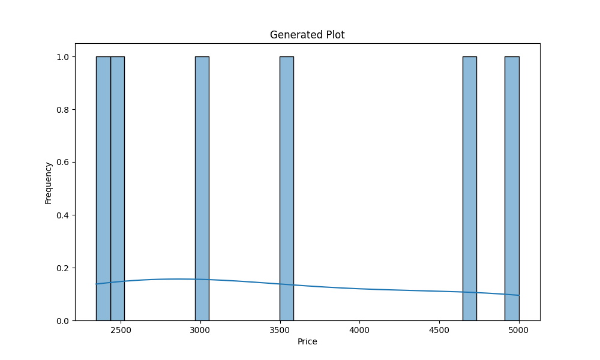
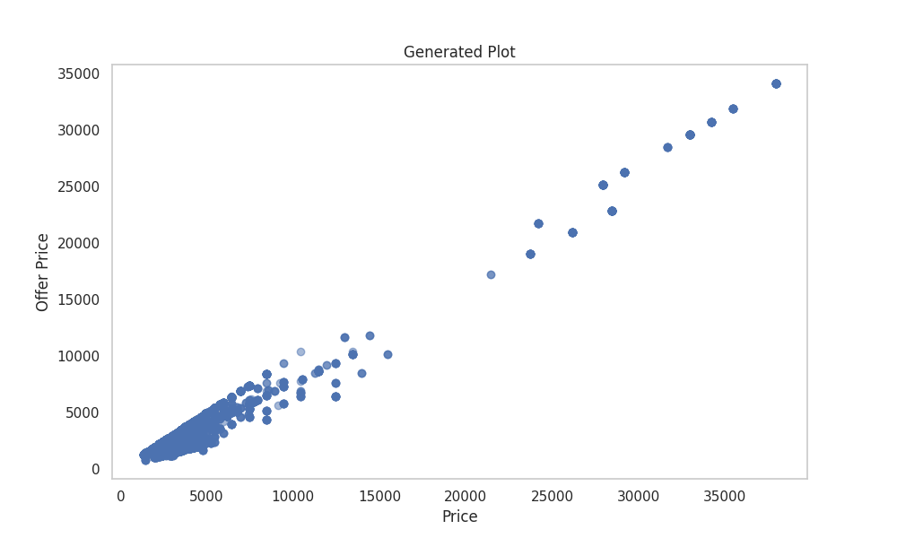
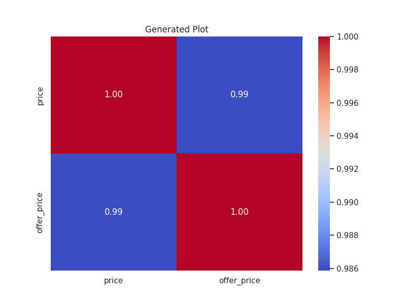
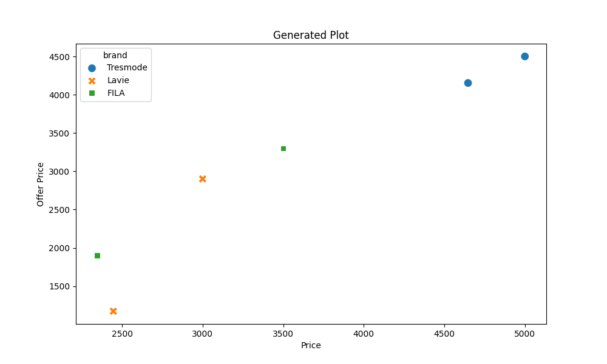
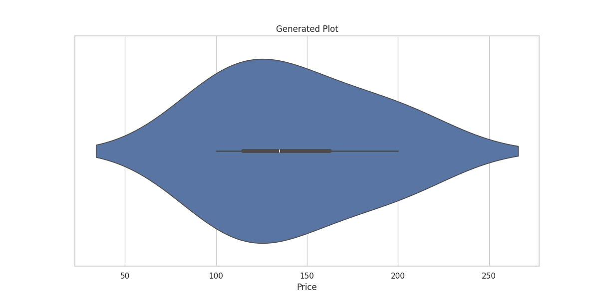

# Data Analysis Story

### The Legend of the Crocs Carousel

In a bustling marketplace where colors danced like the vibrant Indian sun, the tale of Crocs unfolded—an epic rippling through countless lives, woven from threads of variety, discounts, and an alluring spectrum of prices. Here, every Croc whispered a unique journey, each intertwined with the ambitions and emotions of its wearers.

Once, a spirited young woman named Riya found herself amidst a sea of choices, as she embarked on her quest for the perfect pair of Crocs. Surrounded by shades of gold, black, and red, she felt an immediate connection to each style, but her heart was captured by a pair of shimmering gold Crocs, a treasure that stood tall at *2,446* rupees. Yet, in a stroke of fate’s hand, the offer price unveiled itself—a mere *1,172* rupees, beckoning her like a siren’s song. Such a dramatic discount hinted at the market’s enchanting dance of desire, echoing the dataset's vital insights, where prices soared to heights of *37,947*, and discounts sank down to *773*, captivating the hearts of savvy shoppers.

With a heart racing like a drummer leading a festival, Riya dove deeper into the world of Crocs. The vast price range revealed an expansive universe. From the delightful budget offerings to the high-end luxury pairs, Crocs catered to the desires of every customer. With a minimum price of just *1,346* rupees, it was clear that glory was accessible to all, a profound truth that kindled hope in the hearts of the young and the dreamers. But hidden among the glitzy prices lay statistics that danced like flame in the night, illuminating that the average regular price stood at *4,945* rupees—an alluring figure indeed, but one that danced *24%* higher than the average offer price of *4,007*.

As Riya sought the wisdom of her friend, Amit, a data analyst known for his cunning insights, he revealed the secret patterns hidden in the Crocs dataset. "You see, Riya," he spoke, his eyes sparkling with enthusiasm, "both prices and offer prices exhibit high variability—like the spirits of a bustling crowd." With a standard deviation of *5,344* and *4,761*, it was apparent that within the kingdom of Crocs, lively competition thrived, and the offer price stood in a grand narrative against its regular counterpart—a striking correlation where high-priced items often wore the cloak of substantial discounts.

But soon, their journey revealed deeper intricacies; a tapestry woven with relationships amongst brands emerged. Each Croc brand had a unique heritage, a story that resonated with its price. Yet, whispers of the dataset hinted that to unravel these correlations, a deeper analysis was essential—a worthy challenge awaiting the heroes.

Amidst their discussion, Riya and Amit pondered, what if customer ratings had the chance to grace this dataset? They could only imagine ratings reflecting the popularity of each style, perhaps creating skewed distributions that celebrated the beloved while leaving the forgotten in shadows. Their imaginations painted scenes where high-priced Crocs basked in adoration, brilliant testimonies of satisfaction bound in slip-resistant comfort.

In this marketplace, they would also uncover a thrilling observation borne of wisdom. Crocs didn’t merely cater to one audience but celebrated the diversity of preferences, promising something for everyone—like a grand festival celebrating India's colors. And as discounts danced joyously through the aisles, customers found themselves enchanted by the perceived value, drawn by a clever strategy lending even luxury to the common folk.

With the brilliance of insight blooming, they devised strategies that made their hearts race. Their recommendations flowed like a river—targeted promotions to highlight variable treasures, a focus on popular styles to ensure stock never dwindled, dynamic pricing that shifted like the wind, attentive to customer desires and competitive rivalries. "We must become the storytellers of Crocs!" Riya exclaimed, her eyes glistening with determination.

As night fell on the market, illuminated stars mirrored the vibrant dreams of customers bound by their hopes and desires. Riya and Amit looked upon the world of Crocs, knowing their journey was just beginning. Amid discounts, brand stories, and the deep connections forged through pricing, they realized they held the power to enrich lives through informed strategies and heartfelt narratives.

Thus, in the grand epic of Crocs, from humble beginnings to soaring heights, every pairing became a love story, every discount a thrilling adventure, and every longing an emotional saga. And as the marketplace twinkled like a galaxy above, the heroic duo embarked on a mission, transforming the art of commerce into a heartfelt legend—a powerful tale blossoming amidst Crocs, illuminating the human experience one pair at a time. 

## Supporting Visualizations

