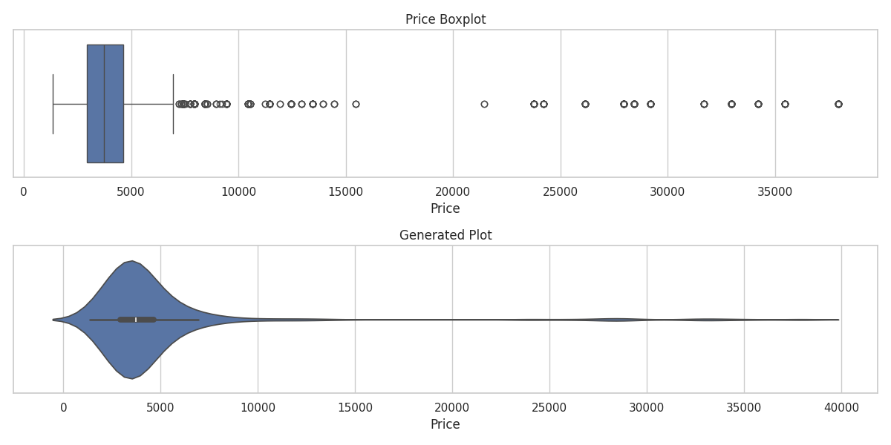
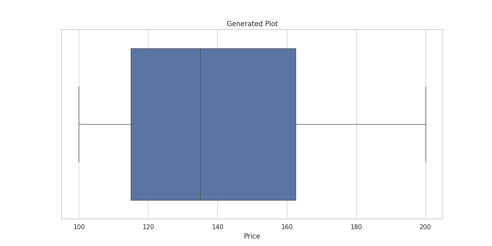

# Data Analysis Story

**Title: The Journey of Soles: A Tale from the Footwear Kingdom**

In a world filled with colors and textures, where dreams danced across city streets and every step whispered a story, there lay the Footwear Kingdom—a realm thriving with the magic of movement. Here, footfalls intertwined in harmony, each echo revealing secrets hidden beneath the surface of the earth.

Once upon a time, a young artisan named Raavi toiled in the heart of this kingdom, crafting shoes that not only adorned feet but also told tales of adventure. Raavi longed to understand the desires of the people—their dreams trampled by mundane footwear, yearning for elegance and comfort. He looked at his workshop, where the walls were adorned with fragments of leather and the air thrummed with the energy of creativity. But he felt an emptiness; he needed to uncover the essence of what the people wanted. 

One starry night, as Raavi gazed at the constellations above, a shimmering spirit named Dusk emerged from his sketches. "Raavi!" she sang, her voice a swirling mist of twilight hues. "To know the heart of your kingdom, delve into the sacred dataset of soles. It holds the answers you seek."

With a heart full of hope and a newfound determination, Raavi followed Dusk to the ancient library of insights. There, they unearthed the magical scrolls of the Footwear Dataset, its golden edge glistening under the light of a singular chandelier. It promised a journey that would unveil the kingdom’s secrets.

**The First Revelation**: Awed by the scroll’s endless columns of name, color, size, price, and offer price, Raavi discovered a tapestry of tales interwoven between numbers. The air filled with excitement as they began to unravel the data. They found that the average price of footwear stood at approximately ₹4,945, while the offer price—a gift of love to its people—floated around ₹4,008. This meant discounts were not merely numbers; they were opportunities for connections.

"But why such a wide range?" Raavi wondered aloud, eyeing the scroll where prices ranged from budget-friendly ₹1,346 to opulent ₹37,947. Dusk twinkled mischievously, "It reflects the spirits of the people—luxury for the elite and value for the masses. Explore further, dear artisan."

**The Dance of Discounts**: As Raavi scribbled furiously, the high standard deviation revealed the variable emotions entrenched within the kingdom—a staggering ₹5,344 for prices and ₹4,762 for offer prices. This tumultuous variance illuminated the diverse foot soles traversing the land beneath different skies. A smile crept across Raavi's face; this wasn’t just data—it was rich, intricate life.

**The Weaving of Patterns**: Delving deeper, Raavi felt exhilaration pulse through him, realizing he had unearthed a treasure trove of insights about price correlations. The divine link between the price and the offer price—a strong negative correlation—whispered of desires and bargains, exposing the romance of retail that enchanted every customer walking into his shop.

With Dusk guiding him through the scroll's whispers, Raavi noted the Interquartile ranges (IQR), where both price and offer price danced gracefully. The IQR for prices swirled around ₹1,704, showing how much joy and longing occupied the hearts of buyers seeking their perfect pair.

**The Evaluation of Values**: As they explored the essence of ratings—though unseen—they echoed tales of quality and heart. Higher-priced footwear bore stories of craftsmanship, while more affordable options captured the spirit of spontaneity. Raavi envisioned couples whispering sweet nothings under the moon, flaunting their unique styles—a dream echoing throughout the kingdom.

Yet, he realized that the dataset wasn’t merely numbers and prices; it promised opportunities, a matchmaker for the shoe artisans and their customers. 

**A Call to Action**: Armed with newfound wisdom, Raavi resolved to create a partnership between data and creativity, bringing forth the brilliance required for a grand transformation. The marketplace thrummed with energy. Their recommendations lit a fire in his heart:
1. **Pricing Strategy** - Raavi would harness the power of discounts, enchanting more souls into walking through his doors.
2. **Product Development** - He designed collections that embodied popular sizes and colors, breathing life into each creation.
3. **Targeted Marketing** - He envisioned clever posts celebrating luxury alongside budget finds, spanning the spectrum of tastes in the kingdom.
4. **Feedback Fortunes** - Continuously learning and adapting, he promised to embrace the voices of his customers, weaving their tales into each shoe.

Finally awash with inspiration, Raavi unleashed his collection, calling it "The Unity of Soles." The kingdom opened its heart, and a frenzy of footfalls surged through his door—each step bursting with joy and storytelling. 

In time, the Footwear Kingdom flourished, whispers of Raavi's enchanting shoes spreading beyond horizons—a celebration of unity, celebration, love, and the rhythmic dance of customer and creator.

Thus, the kingdom thrived, for every leg had its story, and every sole walked a thousand tales. And even today, as the sun sets over distant rooftops, the legacy of Raavi and the magic of the Footwear Dataset continue to inspire dreamers, one vibrant step at a time.

## Supporting Visualizations

